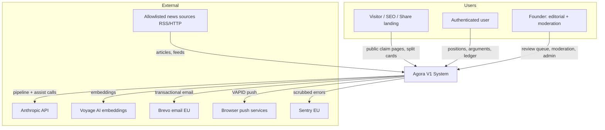
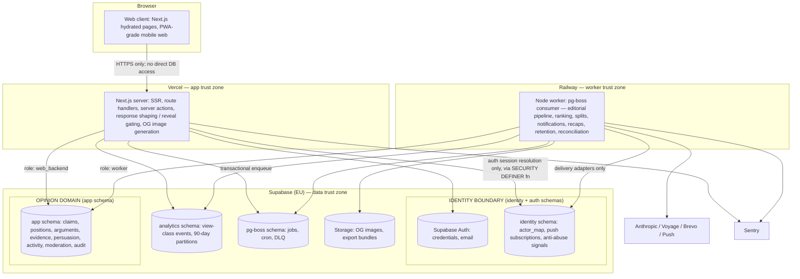

# TECHNICAL_ARCHITECTURE.md — Agora V1

**Version:** 1.0 · 2026-07-12
**Authoritative behavior:** PRD.md v1.1 · UX_ARCHITECTURE.md · DESIGN.md. Companions: DATA_MODEL.md · SECURITY_PRIVACY.md · AI_EDITORIAL_ARCHITECTURE.md · ADR.md.
**Scope:** architecture only — no production application code, no implementation plan, no tasks.

---

## 1. Architecture Objective

Build the **simplest system that correctly ships V1 while making its load-bearing invariants impossible to violate by accident**: commit-to-reveal integrity, append-only positions, persuasion-event eligibility, source-edge mandates, identity/opinion isolation, and editorial auditability.

Optimized for: one founder building with Claude Code · fast iteration · low ops burden · low cost · web-first mobile-first delivery · international English audience · auditability · privacy by design · safe AI editorial automation. Explicitly **not** designed for: hyperscale, microservices, multi-region active-active, or speculative platform generality.

**V1 NECESSITY vs FUTURE OPTION VALUE** — the recurring test applied throughout: a thing is built now only if a V1 behavior requires it *or* DATA_ASSET_STRATEGY §5 says its absence destroys unbackfillable history. Everything else is a documented migration trigger, not code.

---

## 2. Technical Stack Decision

| Concern | Selected | Alternatives considered | Why selected | V1 tradeoffs | Migration trigger |
|---|---|---|---|---|---|
| Language | **TypeScript everywhere** (web + worker + pipeline) | Python worker split | One language, one toolchain, best Claude Code ergonomics, shared domain types across web/worker | TS for data-heavy pipeline code is fine but less idiomatic than Python for NLP glue | Never expected; pipeline could split to Python if ML-heavy later |
| Frontend + server framework | **Next.js (App Router)** | Remix, SvelteKit, Rails+Hotwire | Server rendering is *load-bearing* here (SEO claim pages + server-side leakage control per PRD §7); routed sheets (UX D13); largest ecosystem; app-grade mobile web | Vendor gravity toward Vercel; App Router complexity tax | Framework churn only if Vercel/Next pricing or constraints bite; the domain modules (§4) are framework-independent by design |
| Rendering strategy | SSR for public claim pages (CDN-cacheable, pre-position only); private/no-store SSR for authenticated views; client interactivity islands | Full SPA + API | An SPA cannot guarantee commit-to-reveal in page source or serve SEO; PRD AC-1 demands server-side shaping | — | — |
| API strategy | **Server-side route handlers + server actions; no public API** | tRPC, GraphQL, Supabase auto-API | Smallest surface; response-shaping (reveal gating) lives in one server layer; PRD forbids public API in V1 | Native apps later will want a real API — mitigated by keeping all logic in domain modules called by thin handlers | Native app work (post-Kill-Test-1) extracts a versioned JSON API from the same modules |
| Database | **PostgreSQL 16 via Supabase (managed, EU region)** | Neon, AWS RDS, PlanetScale | One managed Postgres carries everything V1 needs: relational core, FTS (`tsvector`), trigram (`pg_trgm`), vectors (`pgvector`), queue tables, RLS, roles/schemas for the identity boundary; EU region for GDPR posture; generous managed tier | Single DB = single blast radius; acceptable at V1 scale with PITR backups | Read replicas at sustained >70% CPU; queue extraction (below) before DB split |
| Authentication | **Supabase Auth** (email magic link + Google/Apple OAuth; no passwords in V1) | Auth.js, Clerk, custom | Managed identity store that is *already schema-separated* from app data (aligns with SECURITY_PRIVACY §identity isolation); minimal PII (one credential); session persistence for a daily-ritual product | Some lock-in; acceptable (auth data is exportable) | Clerk/custom only if enterprise SSO ever matters (it doesn't for V1) |
| Object storage | **Supabase Storage** (generated OG card images, data-export bundles) | S3, R2 | Same vendor, tiny need | — | R2/S3 if egress costs appear |
| Background jobs + queue | **pg-boss on a dedicated Node worker (Railway)** | BullMQ+Redis, Inngest, Trigger.dev, Vercel cron | Queue lives in Postgres → **transactional enqueue in the same commit as the domain write** (this *is* the outbox; §11 of the prompt), no Redis to operate, retries/DLQ/cron built in; a long-running worker suits the pipeline better than serverless timeouts | Polling latency (~seconds) — irrelevant for this product; queue throughput ceiling ~hundreds/sec — far above need | Inngest/Trigger.dev if pipeline orchestration outgrows code-level steps; Redis queue only at >100 jobs/sec sustained |
| Scheduled jobs | pg-boss cron on the worker; **editorial cutoffs computed in `Europe/Paris` via IANA tz (Luxon/`Temporal`), publication in UTC** | Vercel cron | Same system as jobs; DST-correct by construction (D16) | — | — |
| Search | **Postgres FTS (`websearch_to_tsquery`) + `pg_trgm` for typo tolerance** | Elasticsearch, Typesense, Algolia, Meilisearch | Claims-only corpus is ~1.5–2.5k rows/year; FTS is overqualified. External engines are pure ops burden here | Typo tolerance is "good", not Algolia-grade — acceptable per PRD §13 expectations | Agora Pro research search (argument/evidence cross-claim) is the trigger to evaluate a real engine — LATER by design |
| Vector search (dup detection, evidence retrieval) | **pgvector in the same Postgres** | Pinecone, Qdrant | Corpus is thousands of rows; HNSW in pgvector is trivial at this scale | — | Dedicated vector DB only if library grows >5–10M embeddings |
| Transactional email | **Brevo (EU)** — founder-ratified amendment replacing Resend | Resend, Postmark, SES | EU data-storage posture for a European-operated product handling opinion-adjacent data; removes one US transfer from the processor list; also serves as custom SMTP for Supabase Auth emails (magic links must not ride Supabase's default rate-limited SMTP in production). **Payload rule (founder decision):** emails carry only the minimum content required for delivery; no opinion content ever enters Brevo metadata, tags, contact attributes, or analytics fields — contact records hold address + delivery state only | Slightly weaker DX than Resend | Deliverability or volume-pricing problems |
| Web push | **Standard Web Push (VAPID)** via `web-push` from the worker; subscriptions stored in the identity layer | OneSignal, Firebase | No third-party processor touching notification content; PRD §14 caps enforced in our code | iOS requires PWA install for push — a real reach constraint (risk register §18-item; email is the reliability channel by design) | Native apps (LATER) replace this constraint |
| Analytics | **First-party only**: canonical events in Postgres (PRD §18), metrics as versioned SQL, INT-07 ops report renders them | PostHog, Amplitude, Plausible | Kill-test metrics are **frozen and auditable** (founder decision 4) — they must be computed from the authoritative event tables, not a third-party's interpretation; zero extra processors; PRD §18 explicitly excludes third-party trackers | No funnel-explorer UI — acceptable; the metric set is small and fixed | PostHog EU (no session replay, no autocapture) only if ad-hoc funnel exploration becomes a real recurring need |
| Error monitoring | **Sentry (EU data residency)**, PII-scrubbed per SECURITY_PRIVACY logging rules | Rollbar, self-hosted GlitchTip | Standard, free tier, EU option | — | — |
| Logging | Structured JSON (pino) → platform log retention (Vercel/Railway); no log warehouse | Axiom, Datadog | V1 volume doesn't justify a warehouse; audit needs are served by DB audit tables, not logs | Short platform retention (~3–7 days) | Add Axiom when debugging needs exceed platform retention |
| Deployment | **Vercel (web) + Railway (worker) + Supabase (DB/auth/storage)** | Fly.io all-in-one, single VPS | Three managed dashboards a solo founder can actually operate; preview deploys per PR (Vercel) | Three vendors | Consolidate to Fly/VPS only if cost curves demand |
| CI/CD | **GitHub Actions**: typecheck, lint, unit + invariant tests, migration dry-run, Playwright suite on PR; golden-set pipeline regression on pipeline-affecting changes; deploy on merge | — | Boring, free tier sufficient | — | — |
| Infrastructure as code | **Not in V1.** Environment config documented in-repo (`docs/ops/`); secrets in each platform's manager | Terraform | Three dashboards ≠ IaC payoff for one founder | Config drift risk — mitigated by the docs + a quarterly config audit note | Second engineer or second environment class |
| Testing stack | **Vitest** (unit, domain invariants), **Playwright** (+ `axe-core` for a11y; leakage suite; determinism suite), SQL invariant tests against a disposable test DB, data-driven golden-set tests | Jest, Cypress | §16 below defines the release-blocking set | — | — |
| AI providers | **Anthropic (single LLM provider)**: `claude-sonnet-5` for generation/verification stages, `claude-haiku-4-5` for classification stages, `claude-opus-4-8` for the adversarial gate; **Batches API** for the daily run (50% price, latency irrelevant). **Voyage AI** for embeddings. Full rationale: AI_EDITORIAL_ARCHITECTURE §2 | Multi-provider abstraction, OpenAI, Gemini | See AI doc — single-provider simplicity; the fallback policy is *product-level degradation* (evergreen bank), not hot failover | Provider outage pauses the pipeline (feed degrades gracefully by design, D8) | A second provider is added only if outage frequency actually hurts, or the adversarial gate demonstrably needs cross-family independence |
| News/source ingestion | **RSS/Atom from the allowlist registry** + per-source fetch policy engine; no scraping beyond policy | Aggregator APIs (NewsAPI etc.) | Legal posture first (AI_EDITORIAL_ARCHITECTURE §4); RSS is the universally-licensed discovery layer | Coverage gaps for RSS-less sources | Licensed aggregator API if allowlist coverage proves insufficient |

---

## 3. System Context and Container Architecture

### Context diagram



### Container diagram with trust boundaries



**Trust boundaries (enforced, not aspirational):**
1. **Browser ↔ server:** the client never talks to the database (Supabase client-side auto-API and GraphQL are disabled; RLS deny-all backs this up — SECURITY_PRIVACY §2). All reads pass through server response-shapers.
2. **Identity ↔ opinion:** separate Postgres schemas with separate role grants; the *only* join path is the `resolve_actor()` SECURITY DEFINER function used at session resolution; `analyst_ro` and export paths have **no grant** on identity or auth schemas. Full design: SECURITY_PRIVACY §1.
3. **Worker ↔ external:** all outbound AI/email/push calls originate from the worker or server with per-provider budget guards; ingested news text is treated as untrusted input to the pipeline (prompt-injection posture: AI_EDITORIAL_ARCHITECTURE §5).
4. **Founder surfaces** (review queue, moderation, admin) are routes inside the same app gated by an `admin` role claim + separate audit-logged DB role — no separate deployment in V1 (V1-necessity test: none).

---

## 4. Domain Modules (modular monolith)

One repository, one deployable web app + one worker; modules are directory-level boundaries with explicit public interfaces (TypeScript exports) and a lint-enforced dependency direction. **Rule: modules communicate through public interfaces and domain events (pg-boss messages); no reaching into another module's tables.** Downward-only dependency layers:

```
Layer 0 (kernel):   Identity · Consent/Privacy
Layer 1 (content):  Sources · Claims · EditorialPipeline
Layer 2 (opinion):  Positions · Arguments · Evidence · Persuasion · DebateRanking
Layer 3 (surface):  Feed · Search · Activity/Notifications · Sharing · Ledger/Profiles
Layer 4 (ops):      Moderation · Analytics · AdminOps
```

| Module | Responsibility | Owned entities (DATA_MODEL) | Public interface (representative) | Emits (pg-boss domain events) | Forbidden dependencies |
|---|---|---|---|---|---|
| **Identity** | Auth session ↔ actor resolution; pseudonym registry; anti-abuse signals; push subscriptions | `identity.*`, pseudonym registry | `resolveActor(session)`, `registerPseudonym`, `getQuarantineState` | `actor.created` | MUST NOT import any opinion module |
| **Consent/Privacy** | Consent versions, export, deletion orchestration | `consent_record`, `deletion_tombstone` | `recordConsent`, `requestExport`, `requestDeletion` | `deletion.requested` | — |
| **Sources** | Allowlist registry, source documents, link health | `source`, `source_document` | `getAllowlist`, `registerDocument`, `checkLink` | `source.link_dead` | Opinion modules |
| **Claims** | Claim lifecycle/states, versions, corrections, withdrawal, scheduling, CONFLICT cap | `claim`, `claim_version`, `context_bullet`, `claim_lineage`, `news_cluster` | `publish`, `archive`, `withdraw`, `correct`, `scheduleSlots` | `claim.published`, `claim.closing`, `claim.withdrawn` | Positions/Arguments (claims don't know about opinions) |
| **EditorialPipeline** | 13-stage pipeline runs, candidates, gates, review queue, graduation, tripwires | `pipeline_run`, `claim_candidate`, `stage_artifact`, `editorial_decision`, `category_stats` | `runDaily`, `decide(candidate, decision)`, `graduationState` | `candidate.ready_for_review`, `tripwire.fired` | Everything in layers 2–3 |
| **Positions** | Append-only position events, current-stance projection, retraction, pre_reveal integrity | `position_event`, `position_current`, `split_current` | `takePosition`, `changePosition`, `retract`, `getStance` | `position.created`, `position.changed` | Feed, Notifications (they subscribe, not the reverse) |
| **Arguments** | Arguments, counters, co-signs, endorsements, duplicate detection, edit-freeze | `argument`, `cosign`, `endorsement`, `argument_open` | `compose`(with dup check), `cosign`, `endorse`, `counter`, `recordOpen` | `argument.created`, `argument.countered`, `argument.cosigned` | Persuasion internals |
| **Evidence** | Example library, source edges, suggestions (retrieval-only), disputes, verification states | `example`, `example_source`, `argument_evidence`, `source_dispute` | `suggestFor(argumentText, claim)`, `attach`, `submitSource`, `dispute` | `evidence.disputed` | Generation of any kind (retrieval-only is structural: the module has no LLM-generation dependency) |
| **Persuasion** | Attribution flow, persuasion events, eligibility, MOVED counts, flip-flop voiding | `persuasion_event`, `persuasion_event_status` | `eligibleArguments(actor, claim, positionEvent)`, `attribute`, `movedAggregate(argument)` | `persuasion.recorded` | Any write path other than `attribute` (no MOVED endpoint exists — enforced by module surface) |
| **DebateRanking** | Rank computation, exploration slot, curated-cede, rank versioning | `argument_rank` (materialized), `rank_version` | `rankFor(claim)`, `recompute(claim)` | — | ML libraries (deterministic by decree) |
| **Feed** | Deterministic assembly per PRD §4; fallback inventory | none (pure reads + `claim_stats`) | `assemble(actor, now)` | — | Writes of any kind |
| **Search** | Claims-only FTS | search index (generated columns) | `searchClaims(q, filters)` | — | Arguments/Evidence indexes (Pro-scope guard) |
| **Activity/Notifications** | Activity rows, channel dispatch, caps, batching, local-time delivery | `activity`, `notification_pref`, `push_send_log` | `notify(event)`, `getActivity(actor)` | — | MUST NOT mutate any authoritative product table (prompt §21 rule — enforced by role grants: the notification worker role has no write grant on opinion tables) |
| **Sharing** | Split cards, OG images, share attribution, `PUBLIC_APP_URL` canonicalization | `share_event`, `share_landing`, `invite` | `cardFor(claim|argument|sprint)`, `recordLanding` | — | Split internals (cards are P1-blind by construction: the card renderer receives no split data) |
| **Ledger/Profiles** | Public profile assembly, vindication lines, retraction UI paths | none (reads) | `ledgerFor(pseudonym)` | — | — |
| **Moderation** | Reports, cases, triage, sanctions, appeals, SLA clocks, D11 thresholds | `report`, `moderation_case`, `moderation_action` | `report`, `triage`, `sanction`, `appeal` | `moderation.threshold_fired` | — |
| **Analytics** | Canonical event writes (view-class), metric SQL registry, kill-test freeze | `analytics.event`, `metric_definition` | `track(event)`, `computeMetric(name, window)` | — | Identity schema (structurally no grant) |
| **AdminOps** | Claim ops, source ops, user ops, audit log, weekly ops report | `audit_log`, ops views | `auditedAction(actor, action)` | — | — |

No circular ownership: the dependency layers are acyclic and lint-enforced (`eslint-plugin-boundaries` or equivalent — an implementation detail; the *rule* is architectural).

---

## 5. Commit-to-Reveal — Technical Enforcement (PRD §6/AC-1..4)

**Principle: leakage is prevented by serializer shape, not by hiding.** Two disjoint serializers exist for claims; the pre-position one **has no split fields at all** (absent, not nulled — a test asserts key-absence):

- `ClaimPublicView`: claim, context bullets + sources, teaser argument texts (no counts/ranks/authors' stats), directionless participation total, state metadata. This is the ONLY serializer reachable by: anonymous SSR, CDN-cacheable pages, OG generation, sitemap, search results for un-positioned users, feed cards for un-positioned claims.
- `ClaimRevealedView`: adds split (percent or early-counts per n<25 rule), movement, debate map with all counts. Reachable only when `Positions.getStance(actor, claim)` returns a stance, or atomically in the response to a successful `takePosition` write.

**Caching boundaries:** anonymous claim pages are SSR + CDN-cacheable (they contain only `ClaimPublicView`; safe to cache publicly, which is also the SEO performance path). Authenticated claim pages render with `Cache-Control: private, no-store`. Revealed data never enters any shared cache. The OG image generator takes `ClaimPublicView` as its *only* input type — the blurred bar is a fixed decorative asset, never derived from data (UX §15).

**Visitor reveal:** `POST /claims/{id}/visitor-reveal` — POST (never cached, never in page source), returns the split for the visitor flow. It is rate-limited and bot-filtered but *not* treated as a secret: P1 protects human judgment in the product surface; a curl user bypassing their own blindfold harms no one and never enters splits (visitor taps are uncounted, PRD AC-3). Pending visitor position lives client-side only; on signup, conversion posts it with an explicit `sawSplitFirst=true` marker → `position_created(pre_reveal=false)`. `pre_reveal=true` is set **server-side only** on the authenticated tap path whose render pipeline is `ClaimPublicView` — the client never supplies the flag's positive value.

**Search indexing:** server-rendered public pages contain `ClaimPublicView` only; SERP snippets therefore cannot leak. Sitemap carries URLs + lastmod only. WITHDRAWN → `noindex` + removed from sitemap (PRD §5.8).

**Automated leakage tests (release-blocking, §16):**
1. Unit: serializer key-absence — `ClaimPublicView` output object contains no key from the denylist {split, counts per side, per-argument counts, movement, rank}.
2. Integration: every route that can render a claim is enumerated (route manifest test — fails if a new claim-rendering route isn't classified); each is called as anonymous and as authenticated-unpositioned; response bodies (HTML + embedded JSON) are regex- and structure-scanned against seeded fixture values (seeded split 83/11/6 with distinctive counts like 8311 → assert absence).
3. E2E (Playwright): page-source scan of claim page, feed, search results, OG image endpoint metadata for the seeded fixtures; repeat post-position and assert presence (guarding against over-redaction).

---

## 6. Split Calculation (PRD §12)

**Approach: incrementally maintained counters + nightly reconciliation** (chosen over live aggregation for read cost, and over materialized views for transactional atomicity).

- `split_current(claim_id, agree_n, disagree_n, complicated_n, quarantined_counts…)` updated **in the same transaction** as every `position_event` insert (create/change/retract) and on account deletion. Quarantined accounts (PRD §6.8) tally into shadow columns; on quarantine exit a job folds them into public counts.
- Percentages computed at read time from counters (integer rounding rule: largest-remainder so the three shares sum to 100). n<25 → serializer emits counts-mode payload.
- **Concurrency:** counter updates are single-row `UPDATE … SET x = x + 1` under the same row lock ordering as `position_current` (see DATA_MODEL §3) — no lost updates; throughput ceiling irrelevant at V1 scale.
- **Snapshots:** daily `split_snapshot` at 00:05 UTC per claim with ≥1 position, plus a snapshot at flagship window close (recap input). Movement = `split_current` vs snapshot(now−24h / −7d).
- **Reconciliation:** nightly job recomputes counters from `position_current` and alerts on drift >0 (drift indicates a code-path writing positions outside the transaction pattern — a bug, not a tolerance).
- **Withdrawn claims:** counters frozen at withdrawal; excluded from aggregates by state filter.
- **Caching:** none in V1 — a counter-row read per claim view is cheap. Revealed responses are `no-store` anyway (§5).

## 7. Debate Ranking (PRD §9.4)

- **Inputs (all first-class rows):** `persuasion_event` counts (non-voided, non-quarantined) ×5 · cross-camp CONVINCING ×2 · same-camp CONVINCING ×1 · `log(1+cosigns)` ×1 · STRONG EVIDENCE ×1 · unresolved NEEDS-A-SOURCE ×(−2) · curated-cede tier · exploration bonus.
- **Computation:** worker job recomputes per-claim rankings every **15 min for LIVE claims**, hourly for ARCHIVED claims with activity in the last 7 days; also triggered by `persuasion.recorded` (the king signal shouldn't wait 15 min). Results stored in `argument_rank(claim_id, argument_id, rank_score, position, rank_version, computed_at)` — reads never compute.
- **Determinism & audit:** the formula lives in one pure function with a version constant; every recompute stamps `rank_version`; `rank_version` rows record formula weights + deploy SHA. Changing weights = new version row (auditable per founder decision 4's spirit). Tie-break: `created_at ASC, id ASC`.
- **Exploration slot:** deterministic, not random — slot occupant = eligible new arguments (<72h, <100 impressions) ordered by `hash(claim_id ∥ utc_date ∥ argument_id)`; same claim, same day → same slot for everyone.
- **Curated-cede:** curated arguments carry a sort-tier penalty once any user argument on that side reaches 5 co-signs (constant, configurable).
- **Deleted arguments:** tombstoned rows drop out of ranking at next recompute; their historical persuasion events remain in the event log but display nowhere (PRD §8.11).
- **No ML anywhere in ranking** — restated as an invariant test: the ranking module has no model-call dependency.

## 8. Feed Assembly (PRD §4)

- **Pure deterministic read:** `Feed.assemble(actor, now)` executes fixed SQL over: LIVE claims, `claim_stats` (precomputed movement + argument velocity, refreshed by the 15-min job — quantized inputs make ordering stable between refreshes), actor's arenas, actor's `position_current`, dismissed-nudge state. No per-user cache in V1 (WAU × a few reads/day is nothing); the flagship public payload is CDN-cached (§5).
- **Ranking formula** exactly PRD §4.2, implemented as one pure function over the query rows (same function used in tests).
- **Timezone:** claim-day boundaries in UTC; delivery times per-user local (Notifications §10); the feed itself is timezone-independent apart from status strings computed from UTC timestamps.
- **Fallback inventory:** the assembly query unions, in priority order: LIVE supporting → promoted backlog → evergreen-bank not yet shown to actor (tracked via a per-actor served-evergreen table) → recently-ARCHIVED with high 7-day movement ("still moving"). Section minima per PRD §4.4.
- **Determinism test strategy (release-blocking):** (a) property test — two synthetic actors with identical arenas/positions/dismissals get byte-identical feed order; (b) snapshot test — seeded fixture world → exact expected ordering committed as a fixture; (c) mutation test — flipping one PRD §4.2 weight must break the snapshot (guards against dead formula code).

## 9. Search (PRD §13)

Postgres FTS over a generated `tsvector` column on `claim` (claim sentence, weight A + context bullet text, weight B), `websearch_to_tsquery('english', q)`, ranked by `ts_rank_cd` → state boost (LIVE>ARCHIVED) → recency; `pg_trgm` similarity fallback when FTS yields <3 results (typo tolerance: "good enough" — expectation set in PRD). Domain filter = indexed column predicate. WITHDRAWN/REJECTED excluded by state. **SEO search separation:** Google indexes the public claim pages themselves; in-app search is a private convenience — no `/search` indexing (noindex). **Pro-guard:** no argument/evidence/user indexes exist — future Pro search is a new capability, deliberately unbuilt, preserved as option value by the clean module boundary.

---

## 10. Background Jobs and Scheduling (complete V1 inventory)

All jobs: pg-boss, idempotent by design (keyed on natural ids + upsert semantics), automatic retry with exponential backoff (default 3 attempts unless noted), failures land in pg-boss's failed-job store (the DLQ) with a daily digest to the founder via the ops report + Sentry alert on repeated failure. Monitoring: every job emits a heartbeat row (`job_health`) surfaced in INT-07.

| Job | Schedule | Idempotency | Retry/DLQ notes |
|---|---|---|---|
| Source ingestion (RSS poll + fetch policy) | every 30 min | keyed by canonical URL hash | per-source failure isolation; source flagged after 24h of failures |
| Editorial pipeline daily run | 15:00 Europe/Paris (finishes well before the 20:30 window) | one `pipeline_run` per UTC claim-day; re-run resumes incomplete stages via `stage_artifact` state | stage-level retry ×2; Batches API poll loop; hard token ceiling aborts → degraded-day path |
| Review-queue close + flagship auto-select | **21:00 Europe/Paris (IANA cron; DST-correct)** (D16) | no-op if flagship already set | — |
| Publication scheduler (flagship + supporting slots) | 00:00 / 06:00 / 12:00 UTC | state-machine transition guards (SCHEDULED→LIVE only) | enforces CONFLICT ≤20% cap before each publish (PRD AC-15) |
| Claim window transitions (LIVE→ARCHIVED, Day-2 states, backlog expiry) | hourly UTC | state guards | — |
| Split snapshots | 00:05 UTC daily + at flagship close | unique (claim, snapshot_ts-day) | — |
| Closing recap generation + fanout | at flagship close (48h after 00:00 UTC) | one recap per flagship | recap derived from recorded events only |
| Ranking recompute | every 15 min (LIVE) / hourly (active ARCHIVED) + on `persuasion.recorded` | full recompute per claim (idempotent) | — |
| `claim_stats` refresh (movement, velocity) | every 15 min | overwrite per claim | — |
| Activity + notification dispatch | event-driven (transactional enqueue) + 4h digest batcher | dedupe key per (actor, type, subject, window); global ≤3-push/day cap checked against `push_send_log` in the send transaction | delivery adapters (push/email) retried ×3 then dropped with activity-row fallback (Activity is the reliable channel) |
| Daily Claim local-morning push | hourly sweep: users whose local time just passed 08:00 and flagship live (first local 08:00 within window — resolves the UTC+13/14 edge; see §18/S-flags) | one send per (actor, flagship) | — |
| Weekly ledger recap email | hourly sweep Sundays (local morning) | one per (actor, ISO-week) | — |
| Quarantine exit fold-in | hourly | per-actor state flag | — |
| Source-link health check | daily | per-URL | dead link → corrections workflow event |
| Weekly quality report + ops report (tripwires, founder minutes, moderation thresholds, kill-test tracking) | Monday 08:00 Europe/Paris | one per week | this is the D11/§16.7 surface — failures page the founder |
| Deletion propagation | on `deletion.requested` | tombstone-id keyed; resumable step list | retry until complete; stuck >24h → ops alert (SECURITY_PRIVACY §5) |
| Retention cleanup (90-day view events → aggregates; signup-signal purge; export bundle expiry) | daily 03:00 UTC | partition-drop / watermark | — |
| Split reconciliation | nightly | full recompute compare | drift >0 → Sentry alert |
| Evergreen bank health (count, staleness) | weekly | — | feeds ops report |

**Editorial timing note (D16, DST-correct by construction):** cutoff and review-window jobs are scheduled with `Europe/Paris` IANA cron; publication anchors remain fixed UTC. The Paris-cutoff→UTC-publication gap varies between ~3h and ~4h across DST transitions — both sufficient; a test pins both transition days.

## 11. Notification Architecture (PRD §14)

- **Separation of concerns (hard rule from the prompt):** notification logic **never mutates authoritative product events** — it consumes domain events, writes only `activity`, `push_send_log`, and delivery state. Enforced by DB role: the dispatch code path runs under a role without write grants on opinion tables.
- **Pipeline:** domain event (transactional enqueue) → eligibility filter (prefs, type toggles) → batcher (counters 4h window; co-signs daily digest; split-moved daily best-of) → priority arbiter (P0 exempt; ≤3 pushes/day via atomic check-and-insert on `push_send_log`) → channel adapters (Web Push VAPID; Brevo email — minimal payloads, no opinion content in provider metadata/tags/attributes; Activity row always written first — Activity is the source of truth for "what was I told").
- **Dedupe:** natural keys per type (e.g., `countered:{argument_id}:{4h-bucket}`); resend-safe.
- **Deep links:** all built from `PUBLIC_APP_URL` (D20) + stable routes; email links carry no tracking parameters beyond the notification type (no third-party click tracking — privacy posture).
- **Timezone delivery:** `notification_pref.local_tz` (captured from browser, user-editable) drives the hourly local-time sweeps.
- **iOS reality:** web push requires installed PWA on iOS; the product treats email + in-app Activity as the guaranteed channels and push as progressive enhancement (risk register).

## 12. Sharing, Open Graph, and SEO (PRD §15, D20)

- **`PUBLIC_APP_URL`** is the single configurable canonical origin (per environment: local/preview/production). It drives canonical `<link>`s, OG URLs, share links, generated card links, sitemap entries, notification deep links, email links, and auth callback allowlists. No domain literal appears anywhere else (lint rule + config test). Final domain lands in one env var at the naming phase.
- **OG images:** generated server-side (satori-class HTML→image at the edge or in a route handler), input type = `ClaimPublicView` + card template (blurred bar is a static asset). Cached in Storage keyed by (claim, card-template-version).
- **Share attribution:** share links carry an opaque `s` token → `share_created`/`share_landed` rows; no rewards (D9), no PII in tokens.
- **Sitemap:** claims by domain/date, LIVE + ARCHIVED; WITHDRAWN noindex + omitted. robots.txt: allow public claim pages, disallow `/search`, `/activity`, `/settings`, internal surfaces.
- **Structured data:** minimal `Article`-class metadata on claim pages built from public fields only — the leakage test suite covers JSON-LD output too.

## 13. Analytics Architecture (PRD §23; frozen kill tests)

- **Source of truth:** the canonical event tables of PRD §18 (see DATA_MODEL §6) — product analytics is a *read model over authoritative data*, never a parallel tracker.
- **Metric registry:** `metric_definition(name, version, sql_text, frozen_at, frozen_by)` — the kill-test metrics (activation, D1/D7/W4, flagship participation, commit-to-reveal completion, co-sign rate, argument creation rate, evidence attachment rate, persuasion density, share rate, editorial approval rate, UNFAIR rate, founder minutes) are inserted **frozen before launch** with hash-pinned SQL; the ops report always executes the frozen version; edits require a new version row and cannot alter kill-test rows (revoked UPDATE — same append-only machinery). This is founder decision 4 implemented in the schema.
- **Each metric's source events** are exactly the PRD §23.1 formulas over: `position_event`, `analytics.event` (`claim_viewed`, `split_revealed`, prompt renders), `cosign`, `argument`, `argument_evidence`, `persuasion_event`, `share_*`, `editorial_decision` (timestamps → founder minutes), `claim_flagged`.
- **Surface:** INT-07 weekly ops report + a small internal metrics page; no dashboards product in V1. No session replay, no third-party analytics, no inferred demographics (restated as tests: dependency manifest scan for tracker SDKs fails CI).

## 14. Observability and Auditability (app-level; pipeline traces in AI_EDITORIAL_ARCHITECTURE §7)

- **Structured logs (pino):** request id, route, actor_id (pseudonymous), latency, outcome. **NEVER in logs:** email, IP (beyond the identity-layer anti-abuse store), auth tokens, argument/position content bodies, pseudonym↔auth pairings, push endpoints. Enforced by a serializer allowlist (log schema), not developer discipline — reviewed in SECURITY_PRIVACY §6.
- **Sentry:** errors with scrubbed context (same allowlist); EU residency; no breadcrumbs containing content bodies.
- **Job monitoring:** `job_health` heartbeats + pg-boss failure counts → ops report + Sentry alert rules (pipeline run missed, publication slot missed, deletion stuck, reconciliation drift).
- **Audit log:** every admin/editorial/moderation action → `audit_log` (append-only, revoked UPDATE/DELETE), queryable in AdminOps. Security-relevant events (admin logins, identity-layer access from User Ops, role grants) also audit-logged.
- **AI traces:** every pipeline stage persists prompt version, rubric version, model id, request/response refs, token counts (see AI doc) — the replay/explain surface required by PRD §16.4.

## 15. Environments and Deployment (PRD-level ops, D20)

- **local:** Supabase CLI local stack + Next dev + worker via `npm run worker`; seeded fixture world (see below); mailhog-class local email trap; fake AI mode (recorded fixtures) so the pipeline runs offline.
- **preview:** Vercel preview per PR + a shared preview Supabase project (branch DBs) + preview `PUBLIC_APP_URL` (auto per-deploy); AI calls mocked in CI, live-but-budget-capped on demand.
- **staging:** **not a separate standing environment in V1** (cost/ops test fails); the preview tier + production feature flags cover the need. Migration trigger: first external beta cohort → promote one preview project to a standing staging.
- **production:** Vercel + Railway + Supabase EU; secrets in each platform's secret manager (inventory documented in-repo; no secrets in code or CI logs).
- **Migrations:** SQL migrations in-repo (drizzle-kit or Supabase migrations — implementation choice), applied via CI step with `--dry-run` on PR and apply-on-merge; every migration reviewed against the append-only/RLS/grant invariants (checklist in repo).
- **Seed data:** deterministic fixture world (claims across states/tiers, seeded splits incl. the 83/11/6 leakage fixture, curated arguments, evergreen bank sample, test actors incl. quarantined) — shared by local dev, Playwright, and invariant tests. **Editorial test data:** a frozen golden set of good/bad claim candidates (AI doc §6) lives with the fixtures.
- **Test accounts:** production has zero test accounts; founder account flagged `is_internal` and excluded from all metrics by the frozen SQL.
- **Rollback:** Vercel instant rollback; worker redeploy previous image; DB migrations follow expand-migrate-contract so code rollback never races schema (contract steps ship one release later).

## 16. Testing Strategy (release-blocking set marked ●)

| Layer | Coverage |
|---|---|
| Unit (Vitest) | Domain module logic: ranking formula, feed scorer, split rounding, eligibility rules, serializer shapes, notification batching/caps |
| Database invariant (SQL against test DB) | ● Append-only: UPDATE/DELETE on `position_event`, `persuasion_event`, `audit_log`, `editorial_decision`, `split_snapshot`, `consent_record` raise for app roles · ● `example_source` NOT NULL/FK (source-edge invariant) · ● column-grant matrix matches SECURITY_PRIVACY spec · counter/`position_current` trigger correctness |
| Integration (API level) | ● Persuasion eligibility (PRD AC-6/7: opened-argument requirement D17, single attribution, no MOVED endpoint — route-manifest scan) · ● position change semantics (AC-5, rate limits, flip-flop voiding) · co-sign constraints (AC-8) · duplicate detection (AC-9) · claim state machine incl. ● CONFLICT cap (AC-15) · editorial decisions (AC-16) · corrections vs withdrawal (AC-17) |
| E2E (Playwright) | ● Commit-to-reveal leakage suite (§5) · ● deletion propagation (AC-18) · ● notification caps (AC-14) · ● feed determinism (§8) · onboarding flows (all four entry paths) · visitor conversion truth (AC-3) · share-card integrity (AC-20) |
| Accessibility | axe-core on core surfaces; keyboard traversal of the review queue (DAC-11); reduced-motion snapshot |
| Visual regression | Playwright screenshots of ClaimCard states, split module modes, debate map — guards DESIGN acceptance criteria drift |
| Editorial golden set | ● (release-blocking **for pipeline-affecting changes**): frozen candidate set → gates must reproduce expected pass/fail/escalate decisions within tolerance (AI doc §6) |
| Security | Route authz matrix test (every route × role) · rate-limit tests · dependency audit in CI |

The ● set maps 1:1 to the prompt's required protections: leakage, append-only, persuasion eligibility, source edges, deletion, caps, determinism — plus the golden set.

## 17. Cost Model

Assumptions: EU Supabase Pro; pipeline = ~200 ingested items/day classified (Haiku), ~15 candidates through full generation/verification (Sonnet 5), adversarial gate on Opus 4.8, **all via Batches API (50% discount)**; embeddings Voyage (negligible); email = weekly recap + transactional; MAU→WAU ratio ~0.5, daily pushes free.

| Stage | Infra | AI | Total/month (est.) |
|---|---|---|---|
| Pre-launch dev | Supabase $25 · Vercel $0–20 · Railway ~$10 · rest free | dev + golden-set runs ~$50–150 | **~$100–200** |
| 1,000 MAU | ~$60–80 | pipeline ~$100–250 (≈$3–8/day) + runtime retrieval negligible | **~$200–350** |
| 10,000 MAU | ~$100–150 (DB compute bump, email ~40k/mo) | pipeline unchanged (scales with claims, not users) + retrieval/moderation classify ~$30–60 | **~$300–500** |
| 100,000 MAU | ~$500–1,200 (DB compute, Vercel bandwidth/functions, email ~400k/mo ≈$200–400) | ~$300–600 (user-driven retrieval + moderation volume) | **~$1,000–2,000** |

**Main cost drivers, in order of growth risk:** transactional email at scale → DB compute → Vercel bandwidth → AI (notably *flat-ish*: the editorial pipeline is a fixed daily cost — a structural advantage; user-facing AI is retrieval-only and cheap by design).
**Cost controls (founder-ratified values):** **soft daily alert at $15/day** (ops alert only — the pipeline continues) · **hard daily pipeline stop at $30/day** (halts further non-essential pipeline AI calls for the day and triggers the D8 degraded-day policy — evergreen bank covers the feed) · **monthly workspace cap $500** with a pre-exhaustion operational alert at 80% ($400). The $15 soft target is **explicitly not assumed calibrated**: the implementation plan carries a cost-baselining milestone over the editorial golden set (per-stage tokens/cost, cost per candidate and per published claim, batch-discount impact, retry cost, model distribution, projected 30-day cost), and model allocation may change post-measurement without architecture change (ADR-012). Plus: per-actor rate limits on retrieval endpoints; Supabase/Vercel spend alerts at 2× baseline; monthly cost line in the ops report.

## 18. Implementation Risk Review (self-critique before finalizing)

- **Over-engineered, trimmed:** standing staging environment (cut — preview tier suffices) · multi-provider AI abstraction (cut — single provider + product-level degradation) · Redis/queue infra (cut — pg-boss) · search engine (cut — FTS) · IaC (cut) · per-user feed caching (cut) · event bus (cut — transactional pg-boss enqueue is the outbox).
- **Deliberately kept despite looking heavy:** `stage_artifact` per-stage persistence (PRD §16.4 auditability is a hard requirement — this is the replay/explain substrate) · frozen metric registry (founder decision 4 demands schema-level freezing) · dual serializers + route-manifest leakage tests (the product's central mechanic deserves structural enforcement).
- **Under-engineered, accepted with eyes open:** abuse/sockpuppet detection is heuristic-grade at launch (SECURITY_PRIVACY §7 threat model marks the later-mitigations) · typo tolerance is trigram-grade · no hot AI failover (degradation instead) · single-region, single-DB (PITR is the disaster answer).
- **Unstable-dependency exposure:** publisher RSS feeds (breakage isolated per-source; ops report surfaces silent sources) · Web Push on iOS (email is the guaranteed channel) · Batches API latency variance (pipeline runs 5.5h before the review window; falls back to non-batch API for a late run at 2× token price — bounded by the ceiling).
- **Legally uncertain:** news ingestion/excerpt storage (AI doc §4 defines the conservative V1 policy; counsel items in SECURITY_PRIVACY §8) — architecture keeps all source text quarantined in `source_document` with per-source policy flags so a legal ruling changes *configuration*, not schema.
- **Ops load honesty:** steady-state founder ops stay within PRD §20's budget; the new standing obligations added by this architecture are: weekly ops-report review (already budgeted), monthly config/backup audit (~30 min), and acting on Sentry pages (rare by design). No daemon requires daily human attention.
